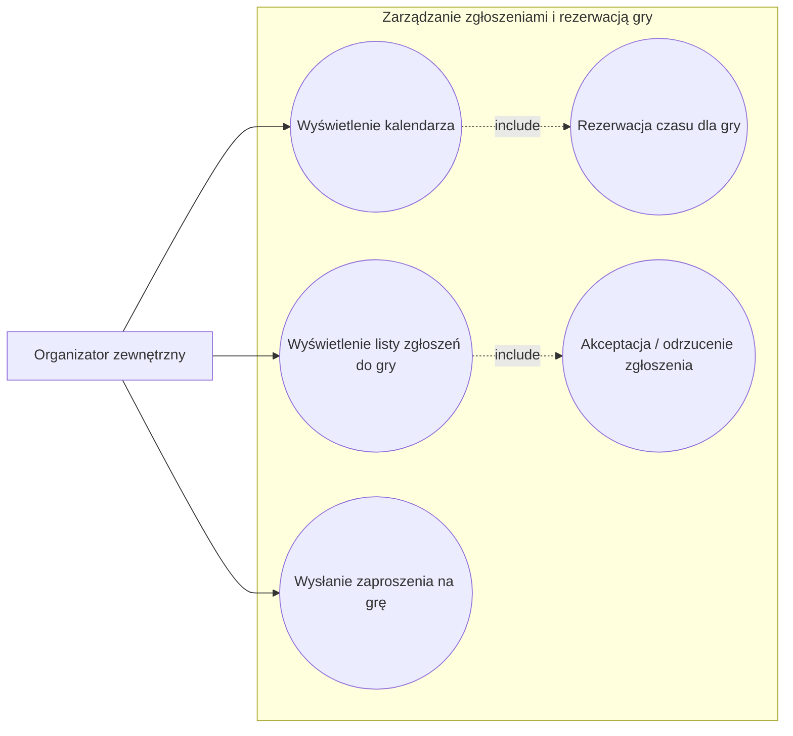

# UC2 – Rezerwacja czasu dla gry 

Organizator wybiera dostępny termin w kalendarzu i dokonuje rezerwacji czasu na rozgrywkę.

Organizator wybiera termin podczas tworzenia gry. Po wypełnieniu formularza dotyczącego tworzenia gry system przekierowuje organizatora do kalendarza, gdzie można zaznaczyć jeden lub kilka dostępnych terminów (nie ma możliwości wybrania niedostępnego terminu). Po wybraniu terminu system prosi o ostateczne potwierdzenie (z możliwością cofnięcia operacji), a po jego zaakceptowaniu – o dokonanie płatności. Po udanej płatności organizator zostaje przekierowany na stronę główną i otrzymuje potwierdzenie w swojej skrzynce wiadomości zaimplementowanej w systemie.

Formularz zawiera pola wymagane.
Kalendarz pobiera dane z formularza i udostępnia godziny w zależności od typu gry (różne gry mają różny czas trwania).

# UC4 – Akceptacja / odrzucenie zgłoszenia 

Organizator analizuje zgłoszenie i podejmuje decyzję o jego akceptacji lub odrzuceniu.

Po zgłoszeniu się użytkownika (gracza) na grę, informacja o jego zgłoszeniu trafia do skrzynki organizatora. Po wejściu do skrzynki i wybraniu zgłoszenia organizator zostaje przekierowany na stronę z krótkim opisem gracza oraz przyciskami „Akceptuj” i „Odrzuć”. Po naciśnięciu jednego z przycisków użytkownik (gracz) zostaje przypisany do gry lub jego zgłoszenie zostaje odrzucone. Wiadomość znika ze skrzynki organizatora. Organizator może zobaczyć gracza na liście uczestników danej gry.

# UC5 – Wysłanie zaproszenia na grę 

Organizator wysyła zaproszenia do wybranych uczestników, informując ich o terminie i szczegółach gry.

Po przejściu do zakładki „Przyjaciele” z głównej strony wyświetlana jest lista znajomych oraz – po przełączeniu widoku – lista wszystkich użytkowników (dostępna jest również funkcja wyszukiwania). Obok każdego użytkownika znajduje się przycisk „Zaproś”. Po jego naciśnięciu wyświetlana jest lista aktualnych gier (które zostały zatwierdzone i mają ustalony termin). Po wybraniu jednej z nich użytkownikowi zostaje wysłane zaproszenie.

# Słownik dziedziny 

Organizator
Osoba zarządzająca grą, odpowiedzialna za rezerwacje, przegląd zgłoszeń i komunikację z uczestnikami.

Kalendarz
Widok zawierający dostępne i zajęte terminy, umożliwiający planowanie rozgrywek.

Rezerwacja
Proces przypisania konkretnego terminu w kalendarzu do planowanej gry.

Termin / slot czasowy
Określony przedział czasu dostępny do zarezerwowania na grę.

Gra
Wydarzenie lub rozgrywka organizowana w określonym czasie dla uczestników.

Zgłoszenie
Prośba uczestnika o udział w grze, oczekująca na decyzję organizatora.

Uczestnik
Osoba zgłaszająca się do udziału w grze.

Akceptacja zgłoszenia
Zatwierdzenie udziału uczestnika w grze przez organizatora.

Odrzucenie zgłoszenia
Odmowa udziału uczestnika w grze.

Zaproszenie
Wiadomość wysyłana do uczestnika z informacją o przydzieleniu do gry i jej szczegółach.
