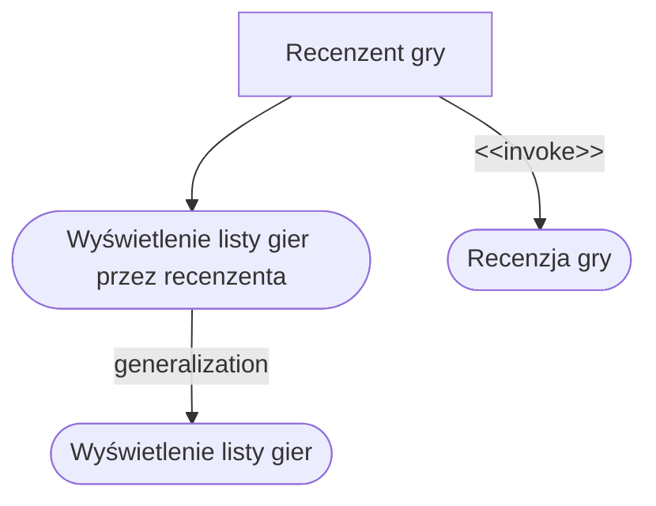

```mermaid
flowchart TB
 A["Recenzent gry"] --> n1(["Wyświetlenie listy gier przez recenzenta"]) -->|generalization| n2(["Wyświetlenie listy gier"])
 A -->|&lt;&lt;invoke&gt;&gt;| n3(["Recenzja gry"])
```
