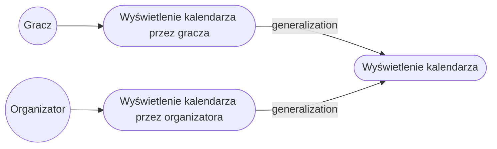

```mermaid
flowchart LR

g((Gracz))
o((Organizator))

ucg(["Wyświetlenie kalendarza przez gracza"])
uco(["Wyświetlenie kalendarza przez organizatora"])
uc(["Wyświetlenie kalendarza"])

g --> ucg
o --> uco

ucg --generalization--> uc
uco --generalization--> uc
```
