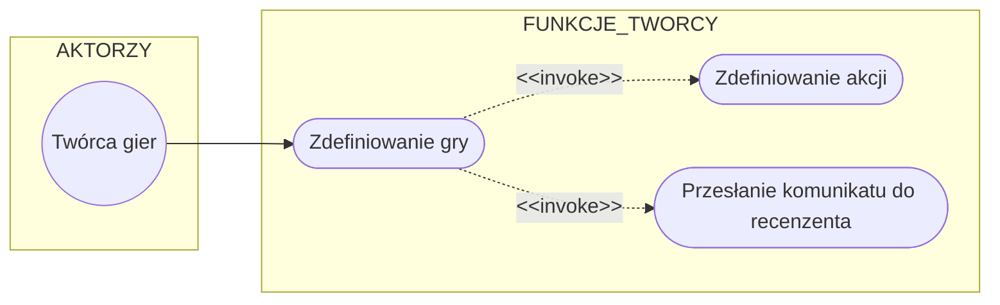

```mermaid
flowchart LR

%% ===== AKTORZY =====
subgraph AKTORZY
TG((Twórca gier))
end

%% ===== FUNKCJE TWORCY =====
subgraph FUNKCJE_TWORCY
GDF([Zdefiniowanie gry])
ADF([Zdefiniowanie akcji])
SCR([Przesłanie komunikatu do recenzenta])
end

%% ===== RELACJE =====
TG --> GDF
GDF -. "&lt;&lt;invoke&gt;&gt;" .-> ADF
GDF -. "&lt;&lt;invoke&gt;&gt;" .-> SCR
```
