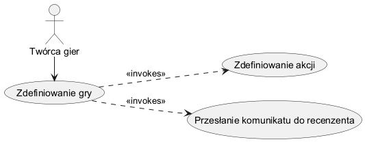

<!--
```
@startuml igorOchocki
left to right direction

actor "Twórca gier" as TG
usecase "Zdefiniowanie gry" as GDF
usecase "Zdefiniowanie akcji" as ADF
usecase "Przesłanie komunikatu do recenzenta" as SCR

TG -> GDF
GDF ..> ADF : <<invokes>>
GDF ..> SCR : <<invokes>>
@enduml
-->

