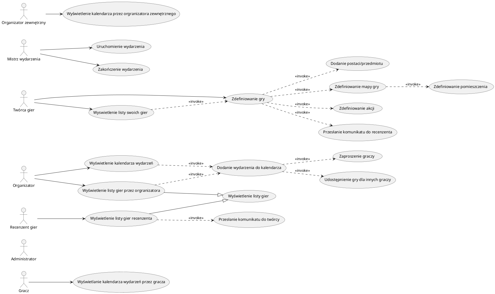

# Słownik

| Termin     | Definicja                                                                                |
| ---------- | ---------------------------------------------------------------------------------------- |
| Gra        | Definicja zasad interakcji między uczestnikami; ma mapę, postacie, akcie itd.            |
| Wydarzenie | Pojedyncza instancja gry.                                                                |
| Postać     | Spójna rola w grze, ma pewne akcje, atrybuty, przedmioty ...                             |
| Przedmiot  | Obiekt nieożywiony, który może posiadać gracz. Posiadanie przedmiotu rodzi różne skutki. |
| Mapa       | Ma pomieszczenia, przeszkody, przejścia.                                                 |
| Akcja      | Działanie systemu pod wpływem interakcji postaci albo czasu.                             |
# Diagram

